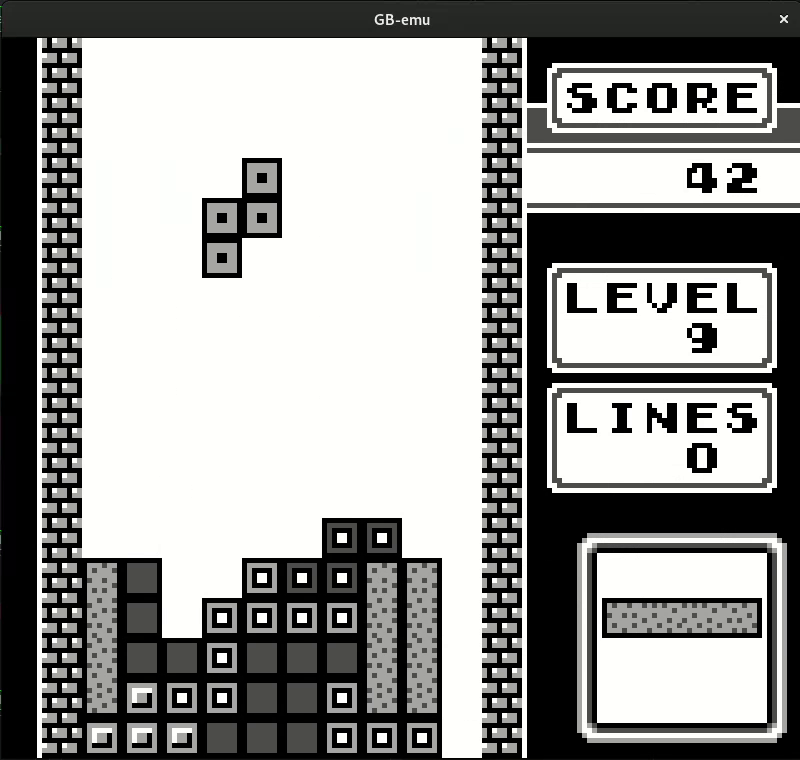
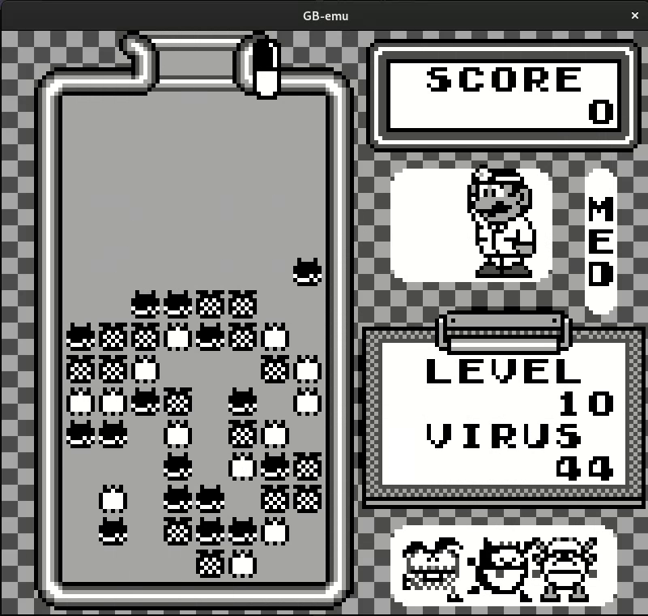

# Game Boy emulator (DMG)

Game Boy emulator written in C.

## Building and running the project
### Prerequisites

- GCC
- SDL2

## Compile
```bash
make
```
## Run
```bash
./emu /path/to/your/rom.gb
```

## Notes
- This project is in early development.

## Demo


